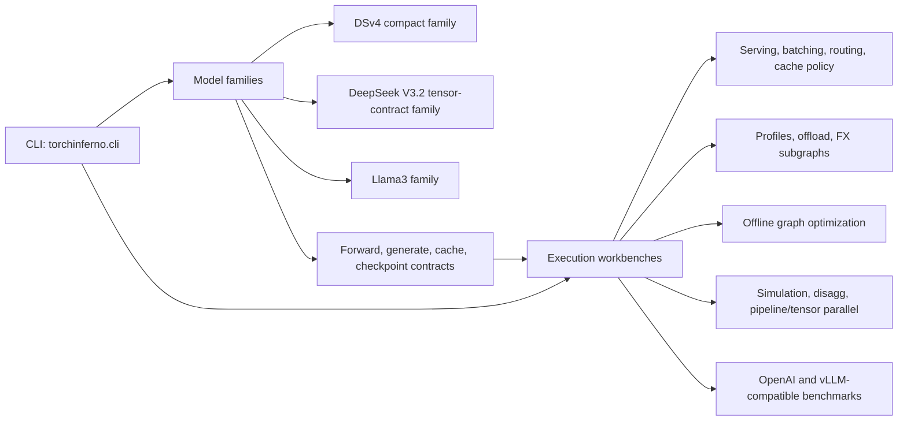

# TorchInferno

TorchInferno is a torch-native inference workbench in the spirit of
[TorchTitan](https://github.com/pytorch/torchtitan). The goal is to make
inference systems easy to trace, optimize, simulate, and extend without booting
a heavyweight serving stack for every experiment.

The current repo is organized around torch-native model families, runtime
workbenches, and offline graph optimization workbenches. Runtime model paths
execute concrete promoted variants; graph capture, partitioning, backend
candidate generation, and promotion happen offline. Capability maturity differs
by family: DSv4 and native DeepSeek are the smallest CPU-friendly correctness
and cache paths, while Llama3 currently carries the production-scale pipeline
and tensor-parallel adapters. The readiness snapshot lives in
[`docs/ROADMAP.md`](docs/ROADMAP.md) and is also available from
[`torchinferno audit`](src/torchinferno/audit.py).

<details>
<summary>Documentation guide</summary>

- [What Works Today](#what-works-today): implemented behavior and readiness.
- [Source Map](#source-map): code ownership, CLI checks, and upstream docs.
- [Quickstart](#quickstart): install, smoke, and Makefile loops.
- [Model Provenance Variants](#model-provenance-variants): raw/fused ladders.
- [Offline Optimization Workflow](docs/OFFLINE_OPTIMIZATION.md): v0 capture,
  partitioning, provider-neutral candidates, benchmarks, and promotion.
- [Serving and Benchmarks](#openai-compatible-serving): OpenAI, vLLM, and Llama
  70B comparison paths.
- [Profile Artifact Runs](#profile-artifact-runs): whole-model, region,
  subgraph, offload, and graph-pattern loops.
- [Repository Layout](#repository-layout): file-by-file map for contributors.

</details>

## What Works Today

- Torch-native model families: compact DSv4, native DeepSeek-V3.2-style, and
  Llama3. These cover pure PyTorch causal LM execution, DeepSeek-style
  attention/MoE contracts, dense and paged KV cache paths, and Llama 70B
  planning plus current pipeline/tensor-parallel adapters.
- Bringup and validation loops: Hugging Face-style checkpoint IO, DeepSeek
  checkpoint audit/conversion, auto model loading, tokenizer-backed generation,
  greedy and temperature sampling, known-logit validation, and
  eager-vs-optimized variant checks.
- Serving and cache policy workbenches: token-step continuous serving,
  OpenAI-compatible chat completions, same-shape microbatching, prefix reuse,
  paged KV allocation, radix/prefix routing, and direct/HTTP serving
  microbenchmarks.
- Distributed and traffic simulation: deterministic time-sliced virtual GPU
  replay, disaggregated prefill/decode planning, editable prefill/decode rank
  files with local JSON-RPC wrappers, fake process groups, fake collectives,
  and bursty traffic modeling.
- Offline graph optimization and promotion workbenches: `make_fx` with
  FakeTensorMode, FX partition/replacement helpers, `torch.compile`
  experiments, provider-neutral backend candidate evaluation, and promoted
  Triton/custom-op/NVFP4 hooks.
- Profiling, research, and benchmark loops: whole-model, region, offload,
  time-sliced, pattern, and node-id subgraph profile artifacts; local
  reference-vs-specialized performance smokes; scheduler/cache/routing research
  comparisons; and vLLM-compatible Llama 70B benchmark reports with JSON,
  HTML, and CSV outputs.

> [!TIP]
> Every command below works either through the installed `torchinferno` console
> script or directly from the checkout with `PYTHONPATH=src python3 -m torchinferno.cli`.

<details open>
<summary>Architecture at a glance</summary>



</details>

Read the diagram as two axes. DSv4, DeepSeek-V3.2, and Llama3 are model
families with their own tensor contracts and provenance. Serving, profiling,
parallelism, benchmarks, and kernel replacement are execution workbenches that
consume those families. Some workbenches are currently wired to one family
first, such as Llama3's production-scale pipeline and tensor-parallel adapters,
but that does not make parallelism a Llama-only concept.

Runtime and optimization are separate phases. Models and serving engines do not
run compilers, tracers, partitioners, or kernel generators in the hot path.
Offline workbenches capture `v0` graphs, try provider-specific replacements
such as Triton, Helion, CuteDSL/CUTLASS, custom CUDA, or PyTorch custom ops,
benchmark candidates, and promote concrete variants that runtime can load
directly. See [`docs/OFFLINE_OPTIMIZATION.md`](docs/OFFLINE_OPTIMIZATION.md)
for the full workflow.

## Source Map

| Surface | Primary code | Fast verification |
| --- | --- | --- |
| DSv4 model family | [`models/dsv4/`](src/torchinferno/models/dsv4/), compatibility [`models/dsv4_family/`](src/torchinferno/models/dsv4_family/) | `dsv4-smoke`, `dsv4-hf-smoke`, `model-variants` |
| DeepSeek-V3.2 model family | [`models/deepseek_v32/`](src/torchinferno/models/deepseek_v32/), compatibility [`models/deepseek.py`](src/torchinferno/models/deepseek.py) | `deepseek-smoke`, `deepseek-hf-smoke`, `deepseek-audit` |
| Llama3 model family | [`models/llama3/`](src/torchinferno/models/llama3/), compatibility [`models/llama3_family/`](src/torchinferno/models/llama3_family/) | `validate-model-variants --family llama3`, `llama-bench-suite` |
| Parallel and distributed execution | [`runtime/`](src/torchinferno/runtime/), [`models/llama3/pipeline.py`](src/torchinferno/models/llama3/pipeline.py), [`models/llama3/tensor_parallel.py`](src/torchinferno/models/llama3/tensor_parallel.py) | `disagg-smoke`, `llama-bench-suite`, `tests/test_llama3_tensor_parallel_distributed.py` |
| OpenAI-compatible serving | [`openai_server.py`](src/torchinferno/openai_server.py), [`openai_http.py`](src/torchinferno/openai_http.py), [`openai_warmup.py`](src/torchinferno/openai_warmup.py), [`runtime/serving.py`](src/torchinferno/runtime/serving.py) | `openai-server`, `openai-microbench`, `openai-server-microbench`, `serve-smoke` |
| Runtime policy experiments | [`runtime/`](src/torchinferno/runtime/) | `sim-smoke`, `traffic-smoke`, `disagg-init`, `disagg-smoke` |
| Offline graph optimization | [`compiler.py`](src/torchinferno/compiler.py), [`graph/`](src/torchinferno/graph/), [`profiling.py`](src/torchinferno/profiling.py), [`docs/OFFLINE_OPTIMIZATION.md`](docs/OFFLINE_OPTIMIZATION.md) | `trace-smoke`, `profile-pattern`, `profile-subgraph` |
| Backend replacement providers | [`kernels/`](src/torchinferno/kernels/), [`research/helion.py`](src/torchinferno/research/helion.py) | `perf-smoke`, `helion-candidate`, `helion-search-fx`, `helion-search-region` |
| Profile artifact loops | [`profiling.py`](src/torchinferno/profiling.py), [`runtime/offload.py`](src/torchinferno/runtime/offload.py) | `profile-run`, `profile-timeslice`, `profile-offload`, `profile-region`, `profile-pattern`, `profile-subgraph`, `profile-nodes` |
| Text, checkpoints, validation | [`tokenization.py`](src/torchinferno/tokenization.py), [`validation.py`](src/torchinferno/validation.py), [`models/auto.py`](src/torchinferno/models/auto.py), [`models/conversion.py`](src/torchinferno/models/conversion.py) | `text-generate`, `capture-logits`, `validate-logits`, `dsv4-hf-smoke`, `deepseek-hf-smoke`, `dsv4-audit`, `deepseek-audit`, `dsv4-convert`, `deepseek-convert` |
| Benchmark comparisons | [`benchmarks/`](src/torchinferno/benchmarks/) | `vllm-bench-suite`, `vllm-bench-plot`, `llama-bench-suite` |

Useful upstream references: [PyTorch `torch.compile`](https://pytorch.org/docs/stable/generated/torch.compile.html),
[PyTorch FX](https://pytorch.org/docs/stable/fx.html),
[Triton](https://triton-lang.org/main/index.html),
[vLLM benchmarking](https://docs.vllm.ai/en/latest/getting_started/examples/benchmarking.html),
[OpenAI Chat Completions](https://platform.openai.com/docs/api-reference/chat/create),
[Hugging Face Hub](https://huggingface.co/docs/huggingface_hub/index), and
[safetensors](https://huggingface.co/docs/safetensors/index).

<details>
<summary>CLI command map</summary>

| Goal | Commands |
| --- | --- |
| Audit and model provenance | `audit`, `model-variants`, `validate-model-variants` |
| Local smoke paths | `dsv4-smoke`, `deepseek-smoke`, `trace-smoke`, `sim-smoke`, `traffic-smoke`, `serve-smoke`, `perf-smoke`, `research-smoke` |
| Checkpoint and text workflows | `dsv4-hf-smoke`, `deepseek-hf-smoke`, `text-generate`, `capture-logits`, `validate-logits`, `dsv4-audit`, `dsv4-convert`, `deepseek-audit`, `deepseek-convert` |
| OpenAI-compatible serving | `openai-server`, `openai-microbench`, `openai-server-microbench` |
| Profile artifacts | `profile-run`, `profile-timeslice`, `profile-offload`, `profile-region`, `profile-pattern`, `profile-subgraph`, `profile-nodes` |
| Disaggregated experiments | `disagg-init`, `disagg-smoke` |
| Backend candidate loops | `helion-candidate`, `helion-search-fx`, `helion-search-region` |
| Benchmark suites | `vllm-bench-suite`, `vllm-bench-plot`, `llama-bench-suite` |

</details>

<details>
<summary>Public Python API map</summary>

| Import | Exports |
| --- | --- |
| [`torchinferno`](src/torchinferno/__init__.py) | `DSv4ForCausalLM`, `DeepSeekV32ForCausalLM`, Llama3 variants, tiny/full config helpers, `compile_forward`, `load_model_auto`, and variant registry helpers. |
| [`torchinferno.runtime`](src/torchinferno/runtime/__init__.py) | Serving requests/results, paged KV cache, prefix cache/router helpers, fake distributed collectives, disaggregated rank helpers, CPU offload helpers, and time-sliced simulation primitives. |
| [`torchinferno.kernels`](src/torchinferno/kernels/__init__.py) | `rms_norm`, `swiglu_activation`, `fused_rmsnorm_swiglu`, paged decode attention APIs, and NVFP4 reference quantization/linear helpers. |
| [`torchinferno.benchmarks`](src/torchinferno/benchmarks/__init__.py) | vLLM-compatible benchmark planning/plotting, native Llama benchmark suites, and OpenAI HTTP server microbench helpers. |

</details>

## Quickstart

From the repo root:

```bash
python3 -m pip install -e ".[dev]"
python3 -m pytest
torchinferno audit
torchinferno dsv4-smoke --device cpu --batch-size 1 --prompt-tokens 3 --new-tokens 2
```

Optional extras are declared in [`pyproject.toml`](pyproject.toml):

| Extra | Adds | Use when |
| --- | --- | --- |
| `dev` | `pytest`, `ruff`, `pyflakes`, `vulture` | Running the local test and lint loop. |
| `serve` / `text` | `transformers`, `tokenizers` | Loading Hub tokenizers or running the OpenAI-compatible server against real checkpoints. |
| `kernels` | [Triton](https://triton-lang.org/main/index.html) | Exercising CUDA kernel specializations instead of torch fallbacks. |
| `helion` | [Helion](https://github.com/pytorch-labs/helion) | Trying one optional generated-kernel provider in the offline promotion flow. |

Without installing the package:

```bash
PYTHONPATH=src python3 -m torchinferno.cli dsv4-smoke --device cpu
PYTHONPATH=src python3 -m torchinferno.cli audit
PYTHONPATH=src python3 -m torchinferno.cli deepseek-smoke --device cpu
PYTHONPATH=src python3 -m torchinferno.cli trace-smoke --device cpu
PYTHONPATH=src python3 -m torchinferno.cli sim-smoke
PYTHONPATH=src python3 -m torchinferno.cli traffic-smoke
PYTHONPATH=src python3 -m torchinferno.cli disagg-init .torchinferno_disagg --prefill-ranks 1 --decode-ranks 1
PYTHONPATH=src python3 -m torchinferno.cli serve-smoke --device cpu
PYTHONPATH=src python3 -m torchinferno.cli perf-smoke
PYTHONPATH=src python3 -m torchinferno.cli profile-run .torchinferno_runs/dsv4-cpu --device cpu
PYTHONPATH=src python3 -m torchinferno.cli profile-timeslice .torchinferno_runs/dsv4-timeslice-cpu --device cpu
PYTHONPATH=src python3 -m torchinferno.cli profile-offload .torchinferno_runs/dsv4-offload-cpu --device cpu
PYTHONPATH=src python3 -m torchinferno.cli profile-nodes .torchinferno_runs/dsv4-cpu --grep embedding
PYTHONPATH=src python3 -m torchinferno.cli profile-subgraph .torchinferno_runs/subgraph-cpu --source-run .torchinferno_runs/dsv4-cpu --nodes 3 --device cpu
PYTHONPATH=src python3 -m torchinferno.cli profile-region .torchinferno_runs/attn0-cpu --region layers.0.attn --device cpu
PYTHONPATH=src python3 -m torchinferno.cli profile-pattern .torchinferno_runs/swiglu-pattern-cpu --device cpu
PYTHONPATH=src python3 -m torchinferno.cli research-smoke
PYTHONPATH=src python3 -m torchinferno.cli vllm-bench-suite .torchinferno_runs/vllm-llama70b --benchmarks latency throughput serve
PYTHONPATH=src python3 -m torchinferno.cli llama-bench-suite .torchinferno_runs/torchinferno-llama70b --benchmarks latency throughput serve
```

Makefile shortcuts wrap the common loops:

| Target | Runs |
| --- | --- |
| `make audit` / `make variants` | Feature readiness and model variant provenance. |
| `make lint` / `make dead-code` / `make test` | Static checks and pytest. |
| `make smoke` / `make perf` / `make openai-server-bench` | CPU smoke and microbenchmark paths. |
| `make profile` / `make profile-region` / `make profile-pattern` | Focused profiling artifact loops. |
| `make vllm-bench-plan` / `make disagg` | Benchmark planning and rank-file generation. |

CUDA is optional for the tests, but the DSv4 and native DeepSeek smokes can run
on GPU:

```bash
PYTHONPATH=src python3 -m torchinferno.cli dsv4-smoke --device cuda
PYTHONPATH=src python3 -m torchinferno.cli deepseek-smoke --device cuda
```

## DSv4 Model Family

The compact model lives in `src/torchinferno/models/dsv4/model.py`. It is the fast
CPU-friendly model family for compiler, cache, serving, and graph-pass
experiments.

```python
import torch

from torchinferno import DSv4ForCausalLM, tiny_dsv4_config

config = tiny_dsv4_config(vocab_size=128, max_seq_len=32)
model = DSv4ForCausalLM(config).eval()
prompt = torch.tensor([[1, 2, 3, 4]])

with torch.inference_mode():
    output = model.generate(prompt, max_new_tokens=4)

print(output)
```

The tests compare incremental cached decode logits against a full causal
forward pass, then exercise generation, local checkpoint save/load, CLI
execution, serving, tracing, and runtime scaffolds.

## Native DeepSeek Path

The native model lives in `src/torchinferno/models/deepseek_v32/model.py`. It mirrors the
production DeepSeek-style tensor contracts rather than compressing them into the
compact DSv4 family.

```python
import torch

from torchinferno import DeepSeekV32ForCausalLM, tiny_deepseek_v32_config

config = tiny_deepseek_v32_config(vocab_size=128, max_position_embeddings=32)
model = DeepSeekV32ForCausalLM(config).eval()
prompt = torch.tensor([[1, 2, 3, 4]])

with torch.inference_mode():
    output = model.generate(prompt, max_new_tokens=4)

print(output)
```

Run a native architecture smoke:

```bash
PYTHONPATH=src python3 -m torchinferno.cli deepseek-smoke --device cpu
PYTHONPATH=src python3 -m torchinferno.cli deepseek-smoke --device cpu --no-q-lora
PYTHONPATH=src python3 -m torchinferno.cli deepseek-smoke --device cpu --score-bias
PYTHONPATH=src python3 -m torchinferno.cli deepseek-smoke --device cpu --cache-backend paged
```

`--no-q-lora` switches the tiny smoke config to a direct query projection,
`--score-bias` enables routed score correction bias, and
`--cache-backend paged` exercises the native paged-cache path.

## Model Provenance Variants

TorchInferno keeps production model code torch-native and provenance-tracked.
Each supported family has an explicit variant ladder. New optimization work
starts from `v0`, runs through the offline graph workflow, and is promoted into
a concrete checked-in variant only after validation and benchmark gates pass:

- `raw_ops.py`: unoptimized Python/PyTorch operation definitions.
- `fused_ops.py`: optimized operation hooks that preserve the raw contract.
- `v0.py`: reference model or full-prefix replay baseline.
- `v1.py`: first fused/cached child of `v0`.
- `registry.py`: parentage, class path, ops module, status, and notes.

DSv4 and native DeepSeek model constructors accept an optional ops module. The
variant classes pass `raw_ops` or `fused_ops` at construction time, keeping
provenance-visible behavior explicit without patching model subtrees after
initialization.

Current families:

- `dsv4`: compact DeepSeek-style DSv4 model family.
- `deepseek-v3.2` / `dsv3.2`: native DeepSeek-V3.2 tensor-contract path.
- `llama3`: torch-native Llama3 model family.

<details>
<summary>Current variant ladder</summary>

| Family | Variant | Status | Role |
| --- | --- | --- | --- |
| `dsv4` | `v0` | reference | Raw Python/PyTorch compact DSv4 baseline. |
| `dsv4` | `v1` | integrated | Fused/cached DSv4 child used by local smoke and profile loops. |
| `deepseek-v3.2` | `v0` | reference | Raw native DeepSeek-V3.2 tensor-contract baseline. |
| `deepseek-v3.2` | `v1` | integrated | Fused/cached native DeepSeek child for paged-cache and serving work. |
| `llama3` | `v0` | reference | Torch-native Llama3 reference model. |
| `llama3` | `v1` | reference | Fused-op Llama3 variant with the same public contract as `v0`. |
| `llama3` | `pipeline-v0` | experimental | Safetensor loader/generate path that places whole decoder layers on devices. |
| `llama3` | `tp-v0` | experimental | Torchrun/NCCL tensor-parallel loader/generate path for production-scale comparisons. |

</details>

The variant ladder tracks model-family provenance. Execution modes are a
separate axis: serving, profiling, disaggregated planning, and parallel
sharding should consume the model families through stable contracts. Llama3 has
`pipeline-v0` and `tp-v0` today because the 70B benchmark requires
production-scale loading, not because parallelism belongs only to Llama3.
Compiler/provider experiments are also a separate axis: they should produce
candidate artifacts first, then become `v1`, `v2`, or a named alternative only
after promotion.

The public Llama 3 70B shape is available as `llama3_70b_config()` for
planning and compatibility checks without constructing the full model:

```python
from torchinferno import llama3_70b_config

config = llama3_70b_config()
print(config.num_hidden_layers, config.hidden_size, config.num_attention_heads)
```

List variants or inspect lineage:

```bash
PYTHONPATH=src python3 -m torchinferno.cli model-variants
PYTHONPATH=src python3 -m torchinferno.cli model-variants --family llama3 --lineage v1
```

This is intentionally branch-friendly: if a new idea should not inherit from
`v1`, add `v1_alt` with parent `v0`, then derive `v2_alt` from that branch.

## vLLM-Compatible Llama 70B Benchmarks

TorchInferno can drive the same vLLM benchmark entrypoints used by the local
vLLM checkout. By default it targets `meta-llama/Llama-3.3-70B-Instruct`,
uses tensor parallel size 8, and writes all commands/results under one output
directory.

Plan the exact commands without running them:

```bash
PYTHONPATH=src python3 -m torchinferno.cli vllm-bench-suite .torchinferno_runs/vllm-llama70b
```

Run latency and offline throughput through vLLM:

```bash
PYTHONPATH=src python3 -m torchinferno.cli vllm-bench-suite .torchinferno_runs/vllm-llama70b \
  --run \
  --benchmarks latency throughput \
  --input-len 32 \
  --output-len 128 \
  --batch-size 8 \
  --num-prompts 1000
```

Run the online serving benchmark against a running vLLM OpenAI-compatible
server:

```bash
PYTHONPATH=src python3 -m torchinferno.cli vllm-bench-suite .torchinferno_runs/vllm-llama70b-serve \
  --run \
  --benchmarks serve \
  --base-url http://127.0.0.1:8000 \
  --request-rate inf
```

The suite writes `commands.json`, `run_status.json`, vLLM result JSON files,
`summary.json`, `performance.html`, and `performance.csv`. To plot existing
vLLM JSON results again:

```bash
PYTHONPATH=src python3 -m torchinferno.cli vllm-bench-plot .torchinferno_runs/vllm-llama70b
```

## Llama3 Parallel Adapters And Benchmarks

TorchInferno's shared benchmark and serving workbenches currently have
Llama3-specific adapters for 70B safetensor checkpoints. `pipeline-v0` keeps
each decoder layer on one device and moves activations at layer boundaries.
`tp-v0` is the closer vLLM comparison point: launch it with `torchrun`, shard
QKV/MLP weights across ranks, use NCCL all-reduce, and keep decode KV cached.

Plan the run:

```bash
PYTHONPATH=src python3 -m torchinferno.cli llama-bench-suite .torchinferno_runs/torchinferno-llama70b-pipeline \
  --devices cuda:0 cuda:1 cuda:2 cuda:3 cuda:4 cuda:5 cuda:6 cuda:7
```

Run the same 32 input / 128 output shape used for the vLLM comparison:

```bash
PYTHONPATH=src torchrun --standalone --nproc-per-node 8 -- src/torchinferno/cli.py \
  llama-bench-suite .torchinferno_runs/torchinferno-llama70b-tp \
  --run \
  --parallelism tensor \
  --benchmarks latency throughput serve \
  --input-len 32 \
  --output-len 128 \
  --batch-size 8 \
  --num-prompts 1000 \
  --max-concurrency 256
```

The native suite writes vLLM-shaped `latency.json`, `throughput.json`, and
`serve.json` files, plus `summary.json`, `performance.html`, and
`performance.csv`, so plots and comparisons can read both backends uniformly.
`batch-size` controls the latency benchmark; throughput and serve use
`max-concurrency` as the engine batch limit.

The tensor-parallel Llama sampler gathers greedy samples across ranks by
default so every worker observes the same token. Set
`TORCHINFERNO_GREEDY_SAMPLE_GATHER=0` to use the greedy distributed reduce
path. Temperature sampling uses the distributed path by default; set
`TORCHINFERNO_TEMPERATURE_SAMPLE_GATHER=1` to try gather-based sampling and
`TORCHINFERNO_TEMPERATURE_SAMPLE_GATHER_STRICT=1` to fail instead of falling
back if that gather path errors.

## OpenAI-Compatible Serving

TorchInferno can run behind an OpenAI-compatible chat completions API:

```bash
PYTHONPATH=src python3 -m torchinferno.openai_server \
  --model meta-llama/Meta-Llama-3.1-70B-Instruct \
  --tensor-parallel-size 8 \
  --single-request-admission-wait-ms 0 \
  --port 8000 \
  --trust-remote-code
```

For local smoke tests without downloading a tokenizer or checkpoint:

```bash
PYTHONPATH=src python3 -m torchinferno.openai_server \
  --model tiny \
  --model-kind tiny-deepseek \
  --tokenizer byte \
  --device cpu
```

The server implements `GET /health`, `GET /v1/models`, and streaming or
non-streaming `POST /v1/chat/completions` in the shape expected by the
[OpenAI Chat Completions API](https://platform.openai.com/docs/api-reference/chat/create).

The same server is available through the main CLI wrapper:

```bash
PYTHONPATH=src python3 -m torchinferno.cli openai-server \
  --model tiny \
  --model-kind tiny-deepseek \
  --tokenizer byte \
  --device cpu
```

For Llama models, the server follows vLLM/sglang-style launch behavior:
`--tensor-parallel-size > 1` auto-launches tensor-parallel worker processes
with `torch.distributed.run` when the command was not already started under a
distributed launcher. External benchmark providers can therefore use the same
plain OpenAI server shape as vLLM and sglang:

```bash
PYTHONPATH=src python3 -m torchinferno.openai_server \
  --model meta-llama/Meta-Llama-3.1-70B-Instruct \
  --tensor-parallel-size 8 \
  --single-request-admission-wait-ms 0 \
  --port 8000 \
  --trust-remote-code
```

Use `--llama-parallelism pipeline` only when you explicitly want the older
single-process layer-placement server.

For a tighter iteration loop on the serving path, run the OpenAI engine
microbenchmark. The synthetic backend isolates Python dispatch, streaming
handoff, admission wait, and same-shape batching without model weights:

```bash
PYTHONPATH=src python3 -m torchinferno.cli openai-microbench \
  --backend synthetic \
  --compare-batcher \
  --concurrency 16 \
  --prompt-tokens 32 \
  --max-tokens 67
```

On an 8xH100 Llama 70B serving shape, launch the model backend under `torchrun`
so tensor-parallel workers use the same OpenAI engine path:

```bash
PYTHONPATH=src torchrun --standalone --nproc-per-node 8 \
  -m torchinferno.cli openai-microbench \
  --backend model \
  --model meta-llama/Meta-Llama-3.1-70B-Instruct \
  --llama-parallelism tensor \
  --tensor-parallel-size 8 \
  --trust-remote-code \
  --compare-batcher \
  --prompt-tokens 32 \
  --max-tokens 67
```

The output reports TTFT, TPOT, end-to-end latency, throughput, forward-call
count, and observed max model batch for direct single-request, forced batcher,
and concurrent cases.

Use `--prompt-mode self-consistency` for the small calculator prompt shape used
by inference-bench style tests. `--phase-timings` records request-to-first
forward, prefix-cache, prefill, sample, and first-token synchronization
breakdowns; `--profile-breakdown` enables model-side timing summaries when the
backend exposes them.

To include the actual HTTP server path in the loop, use
`openai-server-microbench`. With no `--base-url`, it launches a local
`torchinferno.openai_server`, waits for `/v1/models`, then measures
non-streaming and streaming `/v1/chat/completions`; with `--base-url`, it
targets an already-running OpenAI-compatible server.

```bash
PYTHONPATH=src python3 -m torchinferno.cli openai-server-microbench \
  --device cpu \
  --warmup 0 \
  --iters 1 \
  --prompt-tokens 8 \
  --max-tokens 2 \
  --json-output .torchinferno_runs/openai-server-microbench.json
```

OpenAI serving also has explicit environment knobs for production-shape tuning:

- `TORCHINFERNO_OPENAI_AUTO_TORCHRUN=0` disables automatic tensor-parallel
  worker launch. `TORCHINFERNO_TORCHRUN_RDZV_ENDPOINT` overrides the loopback
  rendezvous endpoint used by auto-launched workers.
- `TORCHINFERNO_OPENAI_PREFIX_CACHE=0` disables the bounded OpenAI prefix KV
  cache; `TORCHINFERNO_OPENAI_PREFIX_CACHE_MIN_TOKENS`,
  `TORCHINFERNO_OPENAI_PREFIX_CACHE_MAX_TOKENS`,
  `TORCHINFERNO_OPENAI_PREFIX_CACHE_MAX_ENTRIES` (default `128`), and
  `TORCHINFERNO_OPENAI_PREFIX_CACHE_MATERIALIZE_GENERATED` tune reuse.
- `TORCHINFERNO_OPENAI_PROMPT_TOKEN_CACHE_MAX_ENTRIES` bounds repeated chat
  prompt tokenization reuse; set it to `0` to disable the cache.
- `TORCHINFERNO_OPENAI_STARTUP_WARMUP=0` and
  `TORCHINFERNO_OPENAI_TOKENIZER_WARMUP=0` disable startup warmups.
- `TORCHINFERNO_OPENAI_WARMUP_PROMPT_TOKENS`,
  `TORCHINFERNO_OPENAI_WARMUP_NEW_TOKENS`, and
  `TORCHINFERNO_OPENAI_WARMUP_CACHE_TOKENS` set the default startup warmup
  size; `TORCHINFERNO_OPENAI_WARMUP_PROMPT_TOKEN_BUCKETS`,
  `TORCHINFERNO_OPENAI_WARMUP_PREFILL_CACHE_TOKENS`,
  `TORCHINFERNO_OPENAI_WARMUP_PREFIX_SUFFIX_TOKENS`,
  `TORCHINFERNO_OPENAI_WARMUP_PREFIX_SUFFIX_CACHE_TOKENS`,
  `TORCHINFERNO_OPENAI_WARMUP_TEMPERATURE_PROMPT_TOKEN_BUCKETS`, and
  `TORCHINFERNO_OPENAI_WARMUP_TEMPERATURE_BATCH_SIZES` override graph-warmup
  shape buckets. Temperature warmup batches cover `1`, `8`, `16`, and `64` by
  default.
- `TORCHINFERNO_OPENAI_STREAM_MICROBATCH_SIZE`,
  `TORCHINFERNO_OPENAI_SINGLE_ADMISSION_WAIT_MS`, and
  `TORCHINFERNO_OPENAI_TEMPERATURE_ADMISSION_WAIT_MS` tune live request
  batching behavior.
- `TORCHINFERNO_OPENAI_SHARED_PREFIX_DENSE_GROUP_DECODE` keeps shared-prefix
  prefill while using dense per-length decode for low-variance prompt-length
  groups; the group-count, length-spread, and minimum-size thresholds are
  controlled by the matching `_MAX_GROUPS`, `_MAX_SPREAD`, and `_MIN_SIZE`
  environment variables.
- `TORCHINFERNO_OPENAI_SHARED_PREFIX_PADDED_SUFFIX_PREFILL` batches
  shared-prefix suffix prefill with right padding before ragged decode;
  `_MIN_GROUPS` (default `2`) and `_MIN_SPREAD` (default `1`) control when the
  padded path applies.
- `TORCHINFERNO_OPENAI_RAGGED_DECODE_FULL_BATCH_MIN_ROWS` and
  `TORCHINFERNO_OPENAI_RAGGED_DECODE_FULL_BATCH_MIN_ACTIVE_FRACTION` keep
  larger ragged decode batches at a stable full-batch graph shape while most
  rows are still active. `TORCHINFERNO_OPENAI_RAGGED_DECODE_POWER2_BUCKETS=0`
  disables power-of-two row buckets for sustained ragged decode, and
  `TORCHINFERNO_OPENAI_RAGGED_DECODE_BUCKET_MIN_STEP` controls when those
  buckets begin.
- `TORCHINFERNO_OPENAI_PHASE_TIMINGS=1` records serving phase timings, and
  `TORCHINFERNO_OPENAI_PREFIX_CACHE_SHARED_SAMPLE=1` enables shared-prefix
  cache reuse for temperature sampling.
- Tensor-parallel Llama serving fast paths also respect CUDA graph capture
  toggles including `TORCHINFERNO_CUDAGRAPH_PREFILL`,
  `TORCHINFERNO_CUDAGRAPH_PREFILL_MAX_BATCH`,
  `TORCHINFERNO_CUDAGRAPH_PREFILL_MAX_CACHE_TOKENS`,
  `TORCHINFERNO_CUDAGRAPH_PREFILL_MAX_GRAPHS`,
  `TORCHINFERNO_CUDAGRAPH_DECODE_STEP`,
  `TORCHINFERNO_CUDAGRAPH_RAGGED_DECODE_STEP`,
  `TORCHINFERNO_CUDAGRAPH_DECODE_STEP_MAX_BATCH`,
  `TORCHINFERNO_CUDAGRAPH_DECODE_STEP_MAX_GRAPHS`,
  `TORCHINFERNO_CUDAGRAPH_DECODE_ATTENTION_BLOCKS`,
  `TORCHINFERNO_CUDAGRAPH_QKV_ROTARY`,
  `TORCHINFERNO_CUDAGRAPH_PREFILL_QKV_ROTARY`,
  `TORCHINFERNO_CUDAGRAPH_PREFILL_GATE_UP`,
  `TORCHINFERNO_CUDAGRAPH_ATTENTION_O`,
  `TORCHINFERNO_CUDAGRAPH_MLP`, `TORCHINFERNO_CUDAGRAPH_ALLREDUCE`,
  `TORCHINFERNO_CUDAGRAPH_PREFILL_DEBUG`, and
  `TORCHINFERNO_CUDAGRAPH_DECODE_DEBUG`.
  `TORCHINFERNO_CUDAGRAPH_DECODE_STEP` is enabled by default for CUDA tensor
  parallel decode and can be set to `0` to use eager decode.
  `TORCHINFERNO_CUDAGRAPH_DECODE_STEP_MAX_BATCH` defaults to `64`.
- Tensor-parallel Llama kernel and sampling toggles include
  `TORCHINFERNO_TRITON_DECODE_ATTENTION`,
  `TORCHINFERNO_TRITON_GROUPED_DECODE_ATTENTION`,
  `TORCHINFERNO_TRITON_KV_APPEND`,
  `TORCHINFERNO_TRITON_DECODE_ROTARY_APPEND`,
  `TORCHINFERNO_TRITON_ROTARY`,
  `TORCHINFERNO_TRITON_RMS_NORM`,
  `TORCHINFERNO_TRITON_DECODE_RMS_NORM`,
  `TORCHINFERNO_TRITON_DECODE_ADD_RMS_NORM`,
  `TORCHINFERNO_TRITON_SWIGLU`,
  `TORCHINFERNO_TRITON_DECODE_SWIGLU`,
  `TORCHINFERNO_TRITON_STREAMING_DECODE_ATTENTION`,
  `TORCHINFERNO_TRITON_STREAMING_DECODE_ATTENTION_BLOCK_S`,
  `TORCHINFERNO_TRITON_GROUPED_DECODE_ATTENTION_WARPS`,
  `TORCHINFERNO_DECODE_LINEAR_MV`,
  `TORCHINFERNO_DECODE_TRANSPOSED_WEIGHTS`,
  `TORCHINFERNO_SYMM_MEM_ALLREDUCE`,
  `TORCHINFERNO_SYMM_MEM_PREFILL_ALLREDUCE`,
  `TORCHINFERNO_COMPILE_ROTARY`, `TORCHINFERNO_GREEDY_SAMPLE_GATHER`,
  `TORCHINFERNO_TEMPERATURE_SAMPLE_GATHER`,
  `TORCHINFERNO_TEMPERATURE_SAMPLE_GATHER_STRICT`, and
  `TORCHINFERNO_PROFILE_FAST_PREFILL`.
- `TORCHINFERNO_OPTIONAL_WARNINGS=1` reports optional fast-path fallbacks once
  instead of silently using the torch fallback.

## Offline Graph Optimization

TorchInferno keeps compiler and graph hooks out of the runtime hot path. Models
execute concrete variants; offline workbenches trace, partition, replace,
benchmark, and promote candidates. The guiding document is
[`docs/OFFLINE_OPTIMIZATION.md`](docs/OFFLINE_OPTIMIZATION.md).

Current building blocks:

- `torchinferno.compiler.compile_forward` wraps `torch.compile` for explicit
  experiments and offline comparisons.
- `torchinferno.graph.trace_with_make_fx` wraps `make_fx` and optional fake
  tensor graph capture.
- `torchinferno.graph.PassRegistry` registers ordered FX graph passes.
- `annotate_matching_nodes` records match metadata without changing graph
  behavior.
- `replace_call_function_targets` handles leaf target swaps.
- `replace_call_module_targets` handles module-call replacements.
- `replace_subgraph_pattern` handles multi-node symbolic FX and make_fx/ATen
  replacements for fused custom-kernel regions.
- `torchinferno.kernels.passes.register_kernel_replacement_passes` wires
  reference leaf calls and example fused subgraphs to TorchInferno kernel APIs.

Replacement providers are intentionally pluggable. A graph partition can be
tested with Helion, CuteDSL/CUTLASS, Triton, handwritten CUDA/C++, PyTorch
custom ops, `torch.compile`, or a pure PyTorch rewrite, as long as the
candidate writes comparable artifacts and can be promoted into a concrete
variant.

Trace a DSv4 attention slice:

```bash
PYTHONPATH=src python3 -m torchinferno.cli trace-smoke --device cpu --tokens 2
PYTHONPATH=src python3 -m torchinferno.cli trace-smoke --device cpu --tokens 2 --fake --print-graph
```

Run an explicit `torch.compile` experiment on the DSv4 forward path:

```bash
PYTHONPATH=src python3 -m torchinferno.cli dsv4-smoke \
  --device cpu \
  --batch-size 1 \
  --prompt-tokens 2 \
  --new-tokens 1 \
  --compile
```

First compile is expected to be much slower than eager execution. This command
is an experiment path, not a runtime model requirement.

## Profile Artifact Runs

The profile commands are the fast iteration loop for agent and kernel work.
They put every graph/profile/repro artifact for one experiment in one directory.

`profile-run` runs one generation, captures a forward `make_fx` graph, collects
profiler and memory data, and writes a standalone repro script.

```bash
PYTHONPATH=src python3 -m torchinferno.cli profile-run .torchinferno_runs/dsv4-gpu \
  --model-kind dsv4 \
  --device cuda \
  --batch-size 1 \
  --prompt-tokens 8 \
  --new-tokens 8
```

The output directory contains:

- `manifest.json`: artifact index.
- `run_config.json` and `environment.json`: exact run setup.
- `input_ids.json` and `output.json`: deterministic repro inputs and tokens.
- `graph.json`, `graph.txt`, and `graph_module.py`: captured forward graph;
  each JSON node has a stable integer `id` for subgraph extraction.
- `operator_profile.json`: `torch.profiler` key averages as JSON.
- `chrome_trace.json`: Chrome/Perfetto trace from `torch.profiler`.
- `memory_profile.json`: CUDA allocator stats when running on GPU.
- `repro.py`: standalone repro for rerunning the same workload.

Useful variants:

```bash
PYTHONPATH=src python3 -m torchinferno.cli profile-run .torchinferno_runs/deepseek-paged \
  --model-kind deepseek \
  --device cuda \
  --cache-backend paged

python3 .torchinferno_runs/dsv4-gpu/repro.py --device cuda
```

When full DSv4 does not fit on one node, use `profile-timeslice` to measure a
compact representative workload and replay the measured duration across virtual
GPU ranks. `--profile-scale` lets you inflate the measured compact latency to a
larger target shape while keeping the artifact loop runnable on one CPU or GPU.

```bash
PYTHONPATH=src python3 -m torchinferno.cli profile-timeslice .torchinferno_runs/dsv4-timeslice-gpu \
  --model-kind dsv4 \
  --device cuda \
  --virtual-gpus 8 \
  --time-slice-us 1000 \
  --context-switch-us 25 \
  --profile-scale 16
```

Time-sliced profile directories contain `representative_output.json`,
`operator_profile.json`, `chrome_trace.json`, `timeslice_summary.json`,
`timeslice_timeline.json`, `memory_profile.json`, and `timeslice_repro.py`.
The timeline records each virtual rank slice with start/end times, scheduling
overhead, executed work, and remaining work.

For full-model shape experiments that do not fit resident on one H100, use
`profile-offload` to keep weights on CPU and explicitly stage modules onto the
target device. It records movement and compute separately so you can subtract
CPU/device paging overhead from the serialized run when estimating a resident
or sharded production runtime.

```bash
PYTHONPATH=src python3 -m torchinferno.cli profile-offload .torchinferno_runs/full-offload \
  --checkpoint /path/to/torchinferno-checkpoint \
  --device cuda \
  --dtype bfloat16 \
  --batch-size 1 \
  --prompt-tokens 128 \
  --new-tokens 1 \
  --warmup 1 \
  --iters 3
```

Offload directories contain `offload_summary.json`, `offload_events.json`,
`output.json`, `input_ids.json`, and `offload_repro.py`. The first
implementation uses full-prefix recompute for generated tokens; decode-cache
offload is intentionally left as a production milestone. Add
`--activation-offload` when you also want intermediate activations moved back to
CPU between staged modules.

To inspect node ids from a captured graph:

```bash
PYTHONPATH=src python3 -m torchinferno.cli profile-nodes .torchinferno_runs/dsv4-gpu
PYTHONPATH=src python3 -m torchinferno.cli profile-nodes .torchinferno_runs/dsv4-gpu --grep rms
```

To profile an arbitrary FX slice, pass node ids from the source run. `--nodes`
accepts ids, comma lists, and inclusive ranges such as `42 43`, `42,43`, or
`42:50`. TorchInferno re-traces the source workload, cuts the selected nodes
into a standalone callable graph, turns outside dependencies into boundary
inputs, profiles only that callable, and compares its output against the same
nodes in the full graph.

```bash
PYTHONPATH=src python3 -m torchinferno.cli profile-subgraph .torchinferno_runs/rms-slice-gpu \
  --source-run .torchinferno_runs/dsv4-gpu \
  --nodes 42:50 \
  --device cuda \
  --iters 50
```

Subgraph directories contain `source_graph.json`, `subgraph_spec.json`,
`subgraph_graph.json`, `subgraph_graph.txt`, `subgraph_graph_module.py`,
`operator_profile.json`, `chrome_trace.json`, `memory_profile.json`,
`output.json`, and `subgraph_repro.py`. `subgraph_spec.json` records selected
nodes, boundary inputs, and output nodes.

To zoom into one module without booting a serving stack, use `profile-region`.
The region name is a normal module path such as `layers.0.attn`,
`layers.0.moe`, `model.layers.0.self_attn`, or `forward`.

```bash
PYTHONPATH=src python3 -m torchinferno.cli profile-region .torchinferno_runs/attn0-gpu \
  --model-kind dsv4 \
  --region layers.0.attn \
  --device cuda \
  --tokens 8 \
  --iters 20
```

Focused region directories contain `region_spec.json`, `region_graph.json`,
`region_graph.txt`, `region_graph_module.py`, `operator_profile.json`,
`chrome_trace.json`, `memory_profile.json`, and `region_repro.py`.

To test a graph-pass replacement in isolation, use `profile-pattern`. The first
registered pattern is `fused-rmsnorm-swiglu`: TorchInferno traces the reference
ATen graph, applies the kernel replacement registry, profiles reference versus
optimized callables, and writes a comparison.

```bash
PYTHONPATH=src python3 -m torchinferno.cli profile-pattern .torchinferno_runs/swiglu-pattern-gpu \
  --pattern fused-rmsnorm-swiglu \
  --device cuda \
  --hidden-size 4096 \
  --tokens 16 \
  --iters 50
```

Pattern directories contain `reference_graph.json`, `optimized_graph.json`,
`pass_report.json`, `reference_profile.json`, `optimized_profile.json`,
Chrome traces for both paths, `comparison.json`, and `pattern_repro.py`.

## Disaggregated Rank Files

`disagg-init` generates one standalone Python file per rank. Each file owns one
rank role, one model instance, and a small local RPC wrapper. The files are
intended to be edited directly by agents while preserving the `prefill` and
`decode` RPC contracts.

```bash
PYTHONPATH=src python3 -m torchinferno.cli disagg-init .torchinferno_disagg \
  --prefill-ranks 4 \
  --decode-ranks 4 \
  --base-port 8800 \
  --device cuda
```

Start ranks in separate shells:

```bash
python3 .torchinferno_disagg/rank_0_prefill.py
python3 .torchinferno_disagg/rank_4_decode.py
```

Then send a request through live rank endpoints:

```bash
PYTHONPATH=src python3 -m torchinferno.cli disagg-smoke \
  --prefill-url http://127.0.0.1:8800 \
  --decode-url http://127.0.0.1:8804 \
  --prompt 1 2 3 \
  --new-tokens 2
```

The first implementation transfers tiny DSv4 KV state through JSON for
inspectability. That is deliberately simple and agent-friendly; production
transport can replace the wrapper with gRPC/binary page descriptors while
keeping the rank files and method contracts intact.

## Runtime Scaffolds

The runtime package is where simulation-first serving work belongs:

- `runtime.simulation`: simple virtual GPU time slicing.
- `runtime.scheduler`: disaggregated prefill/decode planning.
- `runtime.disagg`: agent-editable rank files and local RPC wrappers for
  executable prefill/decode experiments.
- `runtime.fake_dist`: fake process groups and collectives.
- `runtime.offload`: CPU/device module staging and transfer-overhead summaries.
- `runtime.paged`: page-table-shaped KV cache allocation and materialization.
- `runtime.paged_attention`: correct torch paged causal attention reference.
- `runtime.prefix`: radix prefix tree and prefix-aware routing.
- `runtime.prefix_cache`: prefix cache lookup plus tensor KV snapshot/restore
  helpers for reusable entries.
- `runtime.sampling`: shared greedy and temperature sampling helper.
- `runtime.serving`: token-step continuous serving engine for native DeepSeek
  cache-policy and prefix-aware request experiments.
- `runtime.traffic`: deterministic request burst/diversity simulation.
- `runtime.flex`: flex-attention-shaped API with an eager fallback.
- `runtime.cudagraphs`: named piecewise CUDA graph execution API.

Example disaggregated simulation:

```bash
PYTHONPATH=src python3 -m torchinferno.cli sim-smoke \
  --prefill-us-per-token 2 \
  --decode-us-per-token 4 \
  --network-latency-us 10
PYTHONPATH=src python3 -m torchinferno.cli traffic-smoke --requests 32 --burst-size 8
PYTHONPATH=src python3 -m torchinferno.cli serve-smoke --device cpu --cache-backend paged
```

## Text And Validation

`load_model_auto` chooses the compact DSv4 or native DeepSeek model from the
checkpoint config. `load_text_tokenizer` loads a local `tokenizer.json` or a
Hugging Face tokenizer behind a minimal encode/decode interface.

```bash
PYTHONPATH=src python3 -m torchinferno.cli text-generate /path/to/checkpoint "hello world" \
  --tokenizer /path/to/tokenizer \
  --device cuda
```

Known-logit references make checkpoint bringup reproducible without a serving
stack:

```bash
PYTHONPATH=src python3 -m torchinferno.cli capture-logits /path/to/checkpoint reference.json \
  --input-ids 1 2 3 \
  --device cuda
PYTHONPATH=src python3 -m torchinferno.cli validate-logits /path/to/checkpoint reference.json \
  --device cuda
```

For model development, compare every optimized tiny variant against its eager
`v0` reference without booting a server:

```bash
PYTHONPATH=src python3 -m torchinferno.cli validate-model-variants --device cpu
PYTHONPATH=src python3 -m torchinferno.cli validate-model-variants \
  --family llama3 \
  --variant v1 \
  --rtol 0.01 \
  --json-output .torchinferno_runs/llama3-v1-logits.json
```

`validate-model-variants` keeps the torchrun/NCCL Llama tensor-parallel case
out of the default CPU loop. Add `--include-tensor-parallel` when the current
process group is ready and you want to include `llama3:tp-v0` in the comparison.

## Research Harnesses

`torchinferno.research.ResearchHarness` is intentionally small: register named
experiments, run them, and compare metrics. It is enough for agents and humans
to add repeatable policy experiments without inventing a new harness each time.

```bash
PYTHONPATH=src python3 -m torchinferno.cli research-smoke
```

## Custom Kernels

`torchinferno.kernels` exposes production-facing kernel APIs with deterministic
torch fallbacks:

- `rms_norm`: Triton CUDA RMSNorm when CUDA/Triton are available, torch fallback
  otherwise.
- `swiglu_activation`: Triton CUDA SwiGLU activation when available, torch
  fallback otherwise.
- `fused_rmsnorm_swiglu`: graph-friendly custom op for residual-add, RMSNorm,
  weighted gate/up projection, and SwiGLU with Triton CUDA and torch fallback.
- `paged_decode_attention`: decode-token paged attention that uses Triton for
  CUDA-compatible single-token decode and falls back to the torch reference.
- `batched_paged_decode_attention`: request-batched decode attention that
  iterates independent page tables through the same safe backend dispatch.
- `quantize_nvfp4`, `dequantize_nvfp4`, and `nvfp4_linear_reference`: a stable
  NVFP4 quantized-linear contract for graph passes and future fused kernels.

Models call these APIs only after a backend has been checked in or promoted.
The offline optimization workflow is provider-neutral: a partition can be
replaced by Helion, CuteDSL/CUTLASS, Triton, handwritten CUDA/C++, PyTorch
custom ops, `torch.compile` experiments, or pure PyTorch rewrites. Provider
search belongs in offline commands and should produce candidate artifacts for
validation and benchmark comparison. Production routes should only move after a
candidate beats the best baseline by the configured threshold and preserves a
safe fallback. Tests compare CUDA Triton outputs against torch references when
CUDA is available.

Search FX windows and remember Helion decisions as one optional provider:

```bash
PYTHONPATH=src python3 -m torchinferno.cli helion-candidate \
  --candidate swiglu \
  --device cuda
PYTHONPATH=src python3 -m torchinferno.cli helion-search-fx \
  --candidate swiglu \
  --batch-size 1000 \
  --tokens 32 \
  --hidden-size 3584 \
  --max-nodes 5 \
  --remember .torchinferno_runs/helion-decisions.jsonl
```

Search real model regions the same way. The region path traces a torch-native
CPU/fake graph offline for discovery and can benchmark generated candidates on
CUDA:

```bash
PYTHONPATH=src python3 -m torchinferno.cli helion-search-region \
  --model-kind deepseek \
  --region attention \
  --trace-device cpu \
  --device cuda \
  --max-nodes 5
```

Benchmark reference versus specialized paged attention:

```bash
PYTHONPATH=src python3 -m torchinferno.cli perf-smoke --device cuda \
  --heads 8 \
  --seq-len 1024 \
  --head-dim 64 \
  --value-dim 64
```

## Agent Workflow

`AGENTS.md` gives coding agents a short map of where to put model, compiler,
runtime, scheduler, and experiment changes. The repo is intentionally organized
so an agent can add one focused harness or graph pass and verify it with CPU
tests before touching CUDA-only code.

`docs/ROADMAP.md` and `torchinferno audit` keep the implementation status
explicit so scaffolds are not confused for finished production paths.

## Checkpoints

TorchInferno can save and load DSv4-compatible checkpoints with a Hugging
Face-style layout:

```python
model.save_pretrained("/tmp/tiny-dsv4")
loaded = DSv4ForCausalLM.from_pretrained("/tmp/tiny-dsv4")
```

The CLI can load a local checkpoint directory or a Hub repo ID:

```bash
torchinferno dsv4-hf-smoke /tmp/tiny-dsv4 --device cpu
torchinferno deepseek-hf-smoke /tmp/native-deepseek --device cpu
```

For private or gated Hub repos, provide credentials through the environment,
not command-line flags:

```bash
export HF_TOKEN=...
torchinferno dsv4-hf-smoke org-or-user/repo-name --device cuda
```

TorchInferno also has DeepSeek-style checkpoint audit and conversion commands:

```bash
PYTHONPATH=src python3 -m torchinferno.cli dsv4-audit /path/to/deepseek-checkpoint
PYTHONPATH=src python3 -m torchinferno.cli dsv4-convert /path/to/deepseek-checkpoint /tmp/torchinferno-dsv4
PYTHONPATH=src python3 -m torchinferno.cli deepseek-audit /path/to/deepseek-checkpoint
PYTHONPATH=src python3 -m torchinferno.cli deepseek-convert /path/to/deepseek-checkpoint /tmp/torchinferno-native
```

The converters index safetensor shard metadata without loading the whole model,
check every tensor shape against the target model, write sharded safetensors,
and store `torchinferno_conversion_report.json` in the output directory.

Use `deepseek-audit` and `deepseek-convert` for native production architecture
checkpoints. The older `dsv4-*` conversion path remains intentionally
conservative for the compact DSv4 family and still refuses tensors DSv4 cannot
represent exactly.

## Repository Layout

```text
src/torchinferno/
  audit.py                Environment and feature readiness audit.
  openai_server.py        OpenAI-compatible chat completions engine/server.
  openai_http.py          HTTP handler and ThreadingHTTPServer wrapper.
  openai_warmup.py        OpenAI serving graph-warmup bucket parsing.
  compiler.py             torch.compile policy helper.
  cli.py                  CLI smoke, benchmark, validation, and profile runners.
  profiling.py            Whole-run, time-sliced, offload, region, subgraph,
                           and pattern artifact capture.
  tokenization.py         Tokenizer adapters for text IO.
  validation.py           Known-logit capture and validation.
  variant_validation.py   Eager-vs-optimized model variant logit validation.
  kernels/ops.py          Kernel APIs with torch fallbacks.
  kernels/helion_ops.py   Experimental Helion-generated CUDA kernels.
  kernels/triton_ops.py   Triton CUDA rotary, KV, decode attention, RMSNorm,
                           and SwiGLU helpers.
  kernels/paged_attention.py
                           Paged decode attention kernel API.
  kernels/nvfp4.py        NVFP4 quantized-linear reference contract.
  kernels/passes.py       Graph-pass registration for kernel replacements.
  models/*_family/        Backward-compatible import shims.
  models/provenance.py    Variant registry dataclasses and lineage helper.
  models/dsv4/            DSv4-style causal LM, MoE, attention, and KV cache.
  models/llama3/          Torch-native Llama3 raw/fused variants plus current
                           family-specific pipeline and tensor-parallel adapters.
  models/variants.py      Model variant listing and lineage helpers.
  models/auto.py          Config-driven model loader.
  models/deepseek.py      Compatibility alias for the native DeepSeek package.
  models/deepseek_v32/    Native DeepSeek-V3.2-style architecture.
  models/conversion.py    DeepSeek-style checkpoint audit and conversion.
  models/hf.py            Hugging Face-style config and weights IO.
  graph/export.py         make_fx and FakeTensor tracing helper.
  graph/passes.py         FX graph pass registry and replacement helpers.
  benchmarks/openai_server.py
                           HTTP OpenAI server startup/latency microbench.
  benchmarks/torchinferno_llama.py
                           Native Llama latency/throughput/serve benchmark suite.
  benchmarks/vllm_compatible.py
                           vLLM-compatible benchmark commands, summaries, and plots.
  runtime/cudagraphs.py   Piecewise CUDA graph runner API.
  runtime/fake_dist.py    Fake process groups and collectives.
  runtime/flex.py         Flex-attention-shaped fallback.
  runtime/offload.py      CPU/device staging profiler for oversized models.
  runtime/options.py      Environment parsing and optional-path warnings.
  runtime/paged.py        Paged KV cache allocator and materialization.
  runtime/paged_attention.py
                           Paged causal attention reference.
  runtime/prefix.py       Radix prefix and prefix-aware routing.
  runtime/prefix_cache.py Prefix cache lookup and tensor KV snapshot/restore.
  runtime/sampling.py     Shared greedy and temperature token sampling.
  runtime/scheduler.py    Disaggregated prefill/decode planner.
  runtime/serving.py      Token-step continuous serving engine.
  runtime/simulation.py   Time-sliced virtual GPU simulator.
  runtime/traffic.py      Bursty traffic simulation.
  research/harness.py     Auto research experiment harness.
  research/benchmarks.py  Local benchmark helpers.
  research/helion.py      Helion candidate search reports and decision store.
tests/
  test_dsv4_e2e.py        DSv4 e2e and original runtime tests.
  test_deepseek_native.py Native architecture, cache, conversion, and CLI tests.
  test_conversion_and_kernels.py
                           Checkpoint conversion and custom kernel tests.
  test_scaffolding.py     Compiler/runtime/research scaffold tests.
  test_production_workflows.py
                           Text, validation, paged attention, prefix, traffic tests.
  test_performance_specialization.py
                           Triton paged decode, NVFP4, and benchmark tests.
  test_openai_cli.py       Main CLI/OpenAI server wrapper parser tests.
  test_openai_server.py    OpenAI HTTP serving and engine batching tests.
  test_openai_server_microbench.py
                           OpenAI HTTP microbench command and smoke tests.
  test_openai_warmup.py    OpenAI graph-warmup bucket tests.
  test_model_variants.py   Variant registry, Llama3 model, and logit validation tests.
  test_llama3_tensor_parallel_distributed.py
                           Multi-GPU torchrun tensor-parallel compatibility test.
  test_disagg_ranks.py    Disaggregated rank-file and JSON-RPC tests.
  test_profile_artifacts.py
                           Profile artifact, replay, and focused capture tests.
  test_vllm_benchmarks.py  vLLM/native Llama benchmark plan and plot tests.
  test_serving_engine.py   Native paged-cache serving engine tests.
AGENTS.md                 Short contribution map for coding agents.
docs/ROADMAP.md           Feature readiness map and production milestones.
```

## Design Coverage

Implemented as working code and tests:

- DSv4 local inference path.
- Native DeepSeek-V3.2-style inference path.
- DeepSeek-style checkpoint audit and exact compatible conversion.
- Auto model loading.
- Tokenizer-backed text generation.
- Known-logit capture and validation.
- Shared greedy and temperature sampling across model, serving, offload, and
  disaggregated paths.
- One-command profile artifact capture with graph JSON, profiler JSON, memory
  JSON, Chrome trace export, and standalone repro generation.
- Focused module-region profiling with isolated graphs/profiles/repros.
- Arbitrary graph subgraph extraction/profile by stable node id.
- Pattern-profile loop for offline comparison of reference subgraphs against
  registered kernel replacements.
- `torch.compile` experiment path for explicit offline comparisons.
- `make_fx` and fake tensor trace helper.
- Fake process groups.
- Time-sliced multi-rank simulation.
- Time-sliced representative profile replay with virtual GPU timelines.
- CPU-offloaded full-prefix replay with transfer overhead accounting.
- Disaggregated prefill/decode planning.
- Agent-editable standalone rank files for executable prefill/decode RPC
  experiments.
- Token-step continuous serving with same-length prefill/decode batching.
- OpenAI-compatible HTTP serving with streaming/non-streaming chat completions,
  same-shape request microbatching, direct and HTTP microbench loops, and
  auto-launched Llama tensor-parallel workers.
- OpenAI microbench prompt modes, phase-timing summaries, and model profile
  breakdown hooks for serving hot-path analysis.
- Family-specific Llama 3 pipeline and tensor-parallel checkpoint
  loading/generation, plus vLLM-shaped latency, throughput, and serving
  benchmark suites.
- Pattern-match graph replacement entry point for offline candidate generation,
  including a multi-node make_fx/ATen subgraph replacement example.
- Native DeepSeek dense/paged cache backend selection.
- Paged KV allocation plus single-request and request-batched paged causal
  attention references.
- Token-step continuous serving engine with prefix-hit accounting, shared
  prefix-page reuse, persistent row-assigned paged cache state, and same-shape
  prefill/decode microbatching.
- Radix/prefix-aware routing, prefix cache lookup, and tensor KV prefix
  snapshot/restore helpers.
- Bursty traffic simulation.
- Piecewise CUDA graph runner with static CUDA tensor capture and CPU/eager
  fallback.
- Flex-attention-shaped fallback.
- Auto research harness.
- Triton CUDA rotary, KV append, decode attention, RMSNorm, and SwiGLU helpers
  with torch fallbacks or guarded optional dispatch.
- Triton CUDA fused residual-add/RMSNorm/weighted-SwiGLU custom op with torch
  fallback and fake-tensor trace support.
- Triton-backed paged decode attention with torch fallback.
- NVFP4 quantized-linear reference and graph-pass hook.
- Local benchmark harness and CLI.

Still intentionally future work:

- Validated reference files for downloaded production weights.
- Fully ragged persistent batching and production paged/radix/flex attention
  kernels without prefill materialization.
- Fused MoE/NVFP4 kernels beyond the current correct references and
  decode-focused Triton specialization.
- Decode-shape static buffer planning policies on top of the CUDA graph capture
  runner.
- Full production serving scheduler with cancellation and async transport.

## Development Principles

- Keep model code torch-native and easy to trace.
- Keep model families, execution workbenches, and family-specific adapters
  documented as separate axes.
- Keep compilers, graph tracers, partitioners, and backend generators out of
  model and serving hot paths. Promote offline candidates into concrete
  variants before runtime uses them.
- Put experimental runtime policy in explicit harnesses, not hidden globals.
- Prefer simulation-first workflows over heavyweight serving bootstraps.
- Make it easy to zoom into a layer, graph region, cache policy, or scheduler.
- Keep graph and kernel replacement hooks provider-neutral so Helion,
  CuteDSL/CUTLASS, Triton, custom CUDA, PyTorch custom ops, and torch fallbacks
  can compete against the same reference contracts.
- Upstream generic PyTorch improvements where possible, and keep TorchInferno
  thin when the platform can carry the abstraction cleanly.
